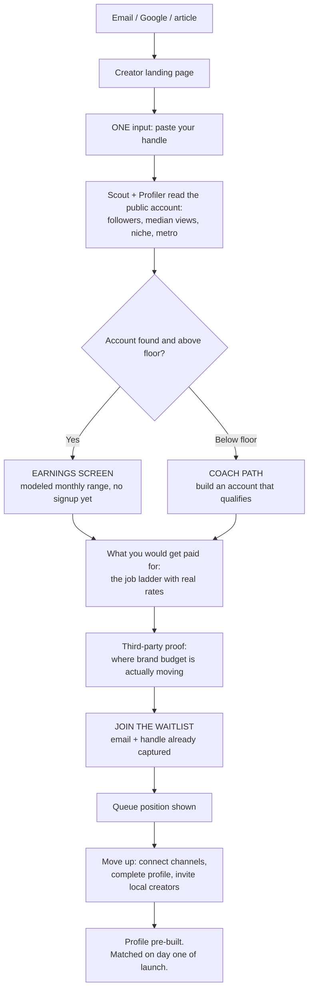
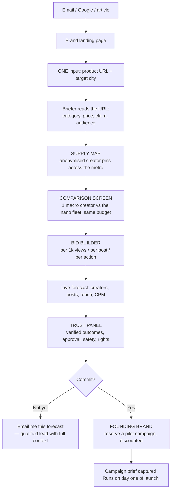
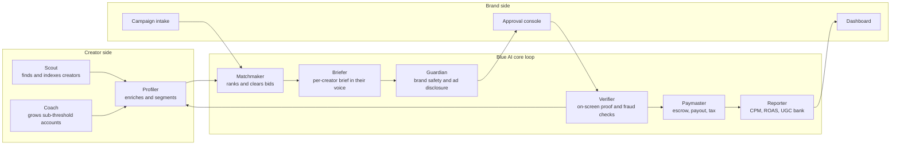

# Blue AI — Two-Sided Onboarding Flows

**Purpose:** how a creator or a brand who lands on our page becomes a committed Blue AI account, and where AI agents replace human coordination in that loop.
**Stage:** pre-launch. No backend, no live campaigns, no case studies. Both flows therefore end in a **waitlist**, not a signup — and the waitlist is designed to do real work, not just collect emails.
**Channels:** Instagram, TikTok, YouTube. *Reddit dropped — see §6.8.*
**Market modeled:** United States, USD.
**All dollar figures are illustrative models for screen design, not researched rate cards.** Assumptions at the end.

**Status:** all nine open questions are now answered — see **§6**. Three decisions remain open, in **§9**, and only one of them blocks anything.

**The three deliverables this doc belongs to:**

| File | What it is | Use it for |
|---|---|---|
| `onboarding-flows.md` | This document | The reasoning and the decisions |
| `index.html` | Clickable prototype — 8 real pages, both journeys | Demoing the actual experience |
| `diagrams.html` | Page inventory, two swimlanes, level-1 DFD | Explaining what each page does and what we store |

---

## 1. The problem with the pages as they stand

Both landing pages are well built and the positioning is right. The conversion mechanism is not.

- The creator page's payoff — *Estimate your earnings* — opens an **8-field form** before showing any value. We are asking a 3,000-follower creator to do data entry on the promise of a number they have no reason to trust yet.
- The brand page's payoff — *Start your campaign* — opens an **even larger form**: brand, message, goal, links, bid unit, bid, budget, dates. We ask for a bid before the brand has seen a single creator or any evidence supply exists in their market.

Neither reference product does this. Kale never asks a creator to type their follower count. Duel never asks a brand to write a brief before showing them dashboards full of revenue.

**The fix, both sides: payoff first, form later. One question per screen. Let the AI do the data entry.**

That inversion is also what makes the AI claim real rather than decorative — the agents start working *during onboarding*, not after signup.

### Five rules the flows follow

1. **One question per screen.** Never a form where a single field will do.
2. **Show the number before asking for the email.**
3. **AI fills in what it can infer.** Handle → followers, views, niche, geo. Product URL → category, audience, message.
4. **Commitment ladder,** each step smaller than the last.
5. **Kill the specific objection on the screen where it occurs.** Creator: *"I'm too small."* Brand: *"unknown people can't beat one big name."*

### The pre-launch constraint, and why it helps

We have no live campaigns, no earnings screenshots, no case studies. Faking any of that would be the fastest way to lose the exact audience we want. So the flows are built on three things we genuinely have:

1. **Public data** — Scout can read any public account today, so the earnings estimate is real work, not theatre.
2. **Third-party evidence** — the Emarketer/WSJ spend shift, Kale's 1.6x UGC conversion, Duel's ROAS numbers. Published, citable, not ours.
3. **Scarcity** — a queue is honest at pre-launch and converts better than a live product, if the queue does something.

**Queue position becomes the engine.** Creators move up by connecting channels, completing their profile, and inviting creators in their own city. That single mechanic pre-collects our matching data, and the referral leg builds the metro density that solves cold start (§6.6). Brands join as **founding brands** with a discounted first campaign — they aren't buying an unproven product, they're joining a pilot, which is a much easier yes.

---

## 1a. What was actually built, and which flow steps each page covers

The prototype collapses the step-by-step flows below into **eight pages**. This table is the bridge between this document and `index.html` — the screen numbers in §2 and §3 map to pages here, not one-to-one.

| Prototype page | Flow steps it covers | What it captures |
|---|---|---|
| `#/creators` | Creator 1–2 — landing + handle capture | Handle only |
| `#/creators/earnings` | Creator 3–5 — estimate, job ladder, proof | **Nothing.** This page only gives |
| `#/creators/waitlist` | Creator 6–8 — join, queue, priority actions | Email, connected channel, niche answers, referrals |
| `#/brands` | Brand 1–2 — landing + intake | Product URL, target city |
| `#/brands/map` | Brand 3 — supply map | Which filters they engaged with |
| `#/brands/compare` | Brand 4 — the comparison | **Nothing.** This page only persuades |
| `#/brands/plan` | Brand 5–6 — bid builder + trust panel | Budget, bid unit, follower floor |
| `#/brands/reserve` | Brand 7 — founding brand | Work email, company, full campaign spec |

Creator step 9 (launch-day activation) has no page — it happens after launch.

**Two of the eight pages capture nothing at all.** That is the point, and it is the single sentence worth leading a walkthrough with: `#/creators/earnings` and `#/brands/compare` exist purely to give something away before we ask for anything.

---

## 2. Creator journey

Objection to kill: **"I'm too small to get paid, and I don't believe your number."**

| # | Screen | The one thing we ask | What AI does | Objection killed | Exit metric |
|---|--------|---------------------|--------------|------------------|-------------|
| 1 | Landing | Nothing | — | "Another subscription?" | Scroll to input |
| 2 | Handle capture | Paste `@handle` | Scout resolves the public account | "This will take ages" | % entering a handle |
| 3 | **Earnings screen** | Nothing | Profiler infers followers, median views, niche, metro; model returns a range | "You know nothing about me" | % scrolling past the number |
| 4 | Job ladder | Nothing | Show every earnable action with its cash rate | "This is vague / a scam" | % expanding the ladder |
| 5 | Proof | Nothing | Third-party spend-shift data, no fake testimonials | "Only big accounts earn" | — |
| 6 | **Waitlist join** | Email | — | — | **Waitlist rate** |
| 7 | Queue position | Nothing | Position + expected launch window | "Is this real?" | — |
| 8 | **Priority actions** | Connect channel / 3 profile Qs / invite | Verifier binds the account; Profiler completes the vector | "What do I get for waiting?" | **% connecting a channel** |
| 9 | Launch day | Nothing | Matchmaker has a complete profile ready | — | **Day-1 activation** |

**Screen 3 is the whole funnel.** It has to land in under two seconds from a single pasted handle, and it must show its working — *"3,200 followers · 4,800 median views · food & drink · Austin"* — because the credibility of the number comes entirely from us having correctly recognised who they are.

**Screen 4, the graded job ladder,** is borrowed from Kale and improved. A 500-follower creator will not open with a produced reel. Give them rungs — comment, story reshare, receipt upload, then a full post — each with its own cash value. Low activation energy, and every rung is a verified outcome we can bill a brand for.

**The Coach path matters more than it looks.** The creator page already promises "no audience yet? Blue AI helps you grow one that qualifies." Today that's a bullet. Making it a real branch means we never bounce a visitor — someone at 300 followers becomes a nurtured lead instead of a dead end. Nobody in the competitive set does this.

---

## 3. Brand journey

Objection to kill: **"130 people I've never heard of cannot beat one creator with 250k followers."**

| # | Screen | The one thing we ask | What AI does | Objection killed | Exit metric |
|---|--------|---------------------|--------------|------------------|-------------|
| 1 | Landing | Nothing | — | — | Scroll to input |
| 2 | Intake | Product URL + city | Briefer scrapes the page for category, price, claim, audience | "I have to write a brief first" | % entering both |
| 3 | **Supply map** | Nothing | Scout returns geo-clustered pins + aggregate reach | **"Does supply exist near me?"** | % interacting with the map |
| 4 | **Comparison** | Nothing | Models both options at their exact budget | **"One big name is safer"** | % scrolling it |
| 5 | Bid builder | Budget + bid unit | Forecast recalculates on every change | "I don't know what to bid" | % moving a slider |
| 6 | Trust panel | Nothing | Verified-only billing, per-creator approval, safety floor, auto-disclosure, rights tiers | "What if it goes off-brand?" | — |
| 7 | **Founding brand** | Company + budget + timing | — | "Why buy something unproven?" | **Reservation rate** |

### The two screens that do the actual selling

**Screen 3 — the map.** Anonymised pins (no handles, no faces) clustered on the target metro, filterable by niche and platform, with a running counter: *"412 creators within 25 miles · 1.9M combined monthly views · 38 in food & beverage."* Supply is the one thing a brand cannot verify for themselves, which is exactly why showing it converts. Pre-launch we build this from public data for the seed metro; outside it, the map is clearly labelled **indicative sample**. Anonymised until they reserve — protects creators, and creates a reason to commit.

**Screen 4 — the comparison.** Your psychology argument, as a screen rather than a bullet. Modeled at $10,000, Austin metro, beverage brand, in-store trial. The macro option is deliberately modeled *generously* — a skeptical buyer will attack an inflated comparison, and the argument still wins decisively without one:

| | 1 macro creator (250k followers) | Blue AI nano fleet |
|---|---|---|
| What $10,000 buys | 2 posts at $4,000 + $2,000 production | ~130 creators, ~190 posts |
| Paid | up front, regardless of result | **only on verified outcomes** |
| Verified views | ~110,000 | ~770,000 |
| Effective CPM | ~$91 | ~$13 |
| Views **inside the target metro** | ~4,400 (4% of followers are local) | **~770,000 (geo-filtered supply)** |
| — that is | 1x | **175x** |
| Distinct creatives / voices | 2 | ~190 |
| Audience reaction | "they were paid a lot to say this" | "someone like me actually bought it" |
| Content rights | negotiated separately, usually extra | included at Tier 1, ~190 assets |
| If it flops | budget already spent | unspent budget returns |

The in-metro row is the one that closes. A national macro creator sells 96% of their reach to people who cannot walk into the store.

**Third-party evidence to cite here** (published claims, not our numbers):

- Nano creators under 5,000 followers take **19.9% of US influencer spend in 2026, up from 3.1% in 2021**; under 20,000 takes ~45%, up from 19.5% — Emarketer, via WSJ, Jul 2026.
- **UGC converts 1.6x better** than brand-produced creative — Kale.
- Programme advocates opened and posted PR boxes at a **30% higher rate** than unaffiliated influencers — Duel / Beekman 1802.
- *"You can spend a quarter or two quarters of a million hiring an agency and a film crew to get that perfectly polished, scripted video, and audiences will just swipe right past it."* — Isha Patel, Kale, in WSJ.

---

## 4. Segmentation schema

Both sides get vectorised, because matching quality is the entire product.

**Creator**

| Group | Fields |
|---|---|
| Geo | country, state, metro, lat/long, radius willing to travel |
| Channel | Instagram / TikTok / YouTube; formats per channel; account age |
| Size band | nano 1k–5k · micro 5k–20k · mid 20k–100k · sub-1k (Coach) |
| Performance | **median** views (not average), view consistency, engagement rate, comment quality, saves/shares |
| Audience | age split, gender split, geo split, top interests |
| Content | niche (multi-label), tone, production tier, cadence, language |
| Commercial | outcome types accepted, minimum rate, exclusivity tolerance, past categories |
| Trust | verified-outcome reliability, on-time rate, disclosure compliance, brand-safety score, bought-view risk |

**Brand**

| Group | Fields |
|---|---|
| Company | category, size, market footprint |
| Product | SKU, price point, where to buy, hero claim |
| Objective | awareness · consideration · conversion · in-store footfall · review volume · UGC bank |
| Target | metro list or radius, audience demo, audience interest |
| Media | channel + format preference, bid unit, bid, budget, pacing, dates |
| Creative | must-say, must-not-say, tone, competitor exclusions, regulated claims |
| Safety | minimum creator trust score, follower floor, blocked verticals |
| Rights | tier required (see §6.5) |

**Matching:** hard filters (geo, channel, dates, safety floor, exclusions) → ranking model (predicted verified views per dollar × content fit × reliability) → clear against the brand's bid. The same auction logic as performance advertising, with creators as inventory.

---

## 5. AI agent architecture

Each agent maps to a salaried role in a traditional influencer agency — which is the entire argument from the insurance example. Remove the human coordination layer and the throughput ceiling disappears.

| Agent | Replaces | Job | Live pre-launch? |
|---|---|---|---|
| **Scout** | Talent scout / sourcing analyst | Index creators by geo, niche, size, performance | **Yes** — powers the estimate and the map |
| **Profiler** | Research analyst | Enrich accounts, infer audience and metro, maintain the vector | **Yes** |
| **Matchmaker** | Campaign manager / media planner | Filter, rank, clear supply against each bid | No — needs demand |
| **Briefer** | Creative strategist / account exec | Per-creator brief in their own format and voice | **Partly** — reads product URLs at intake |
| **Guardian** | Legal / compliance reviewer | Pre-flight safety, enforce disclosure, detect off-brand | No |
| **Verifier** | QA / reporting analyst | Confirm each post live on screen, capture metrics, flag bought views | No |
| **Paymaster** | Accounts payable | Escrow, release on verification, payouts, tax | No |
| **Reporter** | Analyst | Dashboard, CPM, attribution, UGC library | No |
| **Coach** | *nobody today* | Grow creators who don't yet qualify | **Partly** — growth plan at signup |

Reference point for the ceiling claim: Duel already markets **one person managing 15,000 advocates** with AI doing ~90% of manual work. Our claim is the next step — the loop runs without the one person.

---

## 6. Decisions on the nine open questions

Answers, with reasoning, so they can be argued with.

### 6.1 Take rate — **20%, charged to the brand, on top of the creator's payout**

Not split, not deducted from the creator. Creator-side trust is our scarcest asset, and "we take a cut of your earnings" poisons the one line we own: cash, not gift cards. Brands already pay agencies 15–30%, so 20% reads as cheap. It buys us a sentence no competitor can say: **creators keep 100% of their quoted payout.** 20% at launch as land-grab pricing; revisit at 25% once liquidity is proven. Shown to the brand as a line item, never hidden in the CPM.

### 6.2 Fraud — **Blue AI absorbs the brand's risk, the creator carries their own**

If we push bought-view risk onto brands, "pay for verified outcomes, not promises" means nothing.

- **Payment timing is the control.** Verifier reads metrics at **24h / 72h / 7d** and we pay on the **72h reading, not the peak**. That delay is the clawback buffer — no withheld reserve, no extra friction.
- **Detection signals:** view velocity anomaly, engagement-to-view ratio outside band, comment authenticity, follower-growth spikes, audience-geo mismatch against the claimed metro.
- **Three consequences:** (1) flag and hold, creator notified, 48h to respond; (2) partial payout on organically attributable views only; (3) removal and forfeiture of pending balance for repeat or deliberate cases.
- **The brand is never invoiced for an outcome we could not verify.** Escrow returns it.
- **We publish this policy.** It is a trust asset for both sides, not fine print.

### 6.3 Follower floor — **open platform, per-campaign floor set by the brand**

Default 1,000 for paid post campaigns; **zero for micro-actions** (story reshare, comment, receipt). Sub-1k creators still earn something, Coach grows them, and the supply funnel stays wide. Duel gates at 1k and rejects applicants; Kale is effectively open. We are open with brand-level control, which is strictly better for both sides.

### 6.4 Purchase requirement — **not required, per-campaign toggle**

Brand ticks *"requires proof of purchase"*; receipt upload becomes a verified outcome and the brand pays a premium for it, because purchase-verified content converts better and is safer to stand behind. This gets us Kale's trust asset — *reward customers, not influencers* — without Kale's constraint on supply.

### 6.5 Content rights — **three tiers, priced. A revenue line, not a legal clause**

| Tier | Brand gets | Creator keeps | Price |
|---|---|---|---|
| **1 — included** | Reshare on owned organic social + website, with credit | Ownership | in the payout |
| **2 — licence** | 12-month paid-media licence; can run as an ad or whitelist the creator's handle | Ownership | **+40% of payout** |
| **3 — buyout** | Exclusive assignment, no credit required | Nothing | **~+150%, negotiated** |

The creator always keeps the post on their own feed. Both competitors take "brand owns from day one" — being more creator-friendly here is on-brand for our creator pitch *and* it monetises.

### 6.6 Cold start — **supply first. One metro, one category: Austin, food & beverage**

- **Supply first,** because creators join for free and brands will not touch an empty marketplace. The reverse is unfundable.
- **Austin, not LA.** 500 creators in Austin looks *dense* on the map; 500 in LA looks empty — and the map is our strongest brand-side screen. Austin also has unusual DTC food and beverage brand density, which is exactly the client list both competitors sell to.
- **Food & beverage** because it has the highest UGC affinity, the lowest production bar, repeat purchase, and physical retail — so in-store footfall is a measurable objective.
- **Target for launch readiness:** 500 connected creators inside 25 miles of Austin, 10 founding brands. Density over breadth.
- The waitlist referral mechanic (§2, screen 8 — built as `#/creators/waitlist`) exists to hit that number.

### 6.7 Payment system — the vagueness fix

The creator page currently says nothing about how much, how often, or by what method. To this audience, vagueness reads as a scam.

- **Rails:** Stripe Connect Express for US launch — handles onboarding, KYC, and tax forms natively.
- **Trigger:** payout available **immediately on 72h verification**, not on a monthly cycle, not on a tier ladder.
- **Withdrawal:** any time above a **$10 minimum**. ACH free (1–2 days), instant debit 1.5%, PayPal supported. Auto weekly sweep for anyone who never touches it.
- **Tax:** W-9 collected at $600 cumulative; 1099-NEC issued.
- **Transparency, and this is the important one:** before a creator claims a job they see *"you earn $38.40 · verified by Mar 14 · paid by Mar 17."* Three numbers, stated up front, every time.
- **Escrow:** brand funds held on campaign launch, released per verified outcome, unspent balance returned at campaign end.

Contrast to keep in the deck: the WSJ profile of Reid Mottet earning a **$10 gift card** from Club Target, working toward $15, across three separate brand programmes. Cash, fast, in one place, is our creator-side differentiator and it currently appears nowhere on the page.

### 6.8 Reddit — **dropped from the launch set**

Most subreddits ban undisclosed promotional participation outright, and paid commenting can get the creator's account and the brand's domain banned. Neither reference product touches Reddit; both are TikTok and Instagram. Revisit later only via moderator-sanctioned formats such as AMAs.

**Done in the prototype:** the brand page's Reddit card is replaced with TikTok, and the removal is called out on the page in a warning card rather than left as a silent omission — so nobody assumes we forgot Reddit.

### 6.9 TikTok — **in, and it should arguably lead**

TikTok is where nano creators most over-perform against follower count, it is both competitors' primary channel, and it is the natural home for the low-production content this model depends on. Launch set: **Instagram, TikTok, YouTube.**

---

## 7. Economics — illustrative model

**Modeled for screen design. Not researched market rates. Do not put in front of a customer without validation.**

Creator payout, US, 20% platform fee charged to the brand on top:

| Outcome | Creator earns | Brand pays |
|---|---|---|
| Instagram reel | $12.00 / 1,000 verified views | $14.40 / 1,000 |
| TikTok video | $8.00 / 1,000 verified views | $9.60 / 1,000 |
| YouTube integration | $18.00 / 1,000 verified views | $21.60 / 1,000 |
| YouTube Short | $7.00 / 1,000 verified views | $8.40 / 1,000 |
| Instagram story reshare | $5.00 flat | $6.00 |
| Comment / reply on brand content | $1.50 flat | $1.80 |
| Receipt / proof of purchase | $3.00 flat | $3.60 |

**Worked creator example.** 3,200 Instagram followers, 4,800 median reel views; 1,800 TikTok followers, 3,100 median views. Food niche, Austin.

| | | |
|---|---|---|
| 2 sponsored reels | 9,600 views @ $12/1k | $115.20 |
| 2 TikToks | 6,200 views @ $8/1k | $49.60 |
| 4 story reshares | flat | $20.00 |
| 1 receipt | flat | $3.00 |
| **Total** | | **~$188 / month · ~$2,256 / year** |

Note the deliberate restraint: 2 of ~6 monthly posts are sponsored. We do not saturate the feed. That is what keeps the content credible, and it is itself a selling point to brands.

**Worked brand example.** $10,000, Austin metro, beverage, in-store trial → blended brand rate ~$13/1k → **~770,000 verified views, ~$13 CPM, ~130 creators, ~190 posts, 100% in-metro, ~190 owned assets, unspent budget returned.** Full comparison in §3.

---

## 8. Funnel targets to instrument

| Creator | Target | Brand | Target |
|---|---|---|---|
| Land → handle entered | 40% | Land → URL + city entered | 25% |
| Handle → estimate viewed | 95% | Intake → map viewed | 90% |
| Estimate → waitlist joined | 35% | Map → bid builder engaged | 50% |
| Waitlist → channel connected | 45% | Builder → forecast emailed or reserved | 30% |
| Connected → invited ≥1 creator | 20% | Reservation → founding brand confirmed | 40% |
| Waitlist → active on day 1 | 50% | Founding brand → 2nd campaign | 35% |

**North-star, post-launch:** verified outcomes paid per week.
**Pre-launch north-star:** **connected creators within 25 miles of Austin.** Emails are vanity; a connected channel is a real asset.
**Liquidity health:** % of campaigns filled within 48 hours; % of creators with at least one job per month. A two-sided marketplace dies of illiquidity long before it dies of poor conversion.

---

## 9. What still needs a decision

Three items, and only the first one blocks anything.

1. **Buy, scrape, or hand-seed the creator index?** — **This is the blocker.** Two processes read it: resolving a pasted handle, and returning local supply for the map. Until it holds real Austin data, the earnings estimate on `#/creators/earnings` and the map on `#/brands/map` are both illustrative — and those are the two strongest pages we have. Everything else in the system is a form, a model and a table. Hand-seeding one metro is the cheapest way to make both pages real.
2. **Founding-brand discount** — free first campaign, or fee waived and media paid? Affects how qualified the reservations are. Not blocking; the reserve page currently says only *"$0 charged today."*
3. **Launch window we commit to on the waitlist screen.** A queue with no date decays fast. The prototype deliberately shows a position and a target (*first 500 connected creators in Austin*) rather than a date, so this can be answered late.

**Resolved since the last version:** the creator estimate is shown as a **range**, not a single number — built that way in `#/creators/earnings` on the grounds that a pre-launch product cannot afford to overstate a number a creator will later check against reality.

---

## Assumptions behind the illustrative numbers

- Macro creator: 250,000 followers, 22% view-through per post, $4,000 per post, 2 posts + $2,000 production = $10,000; ~4% of followers in any single metro. Modeled generously on purpose.
- Nano fleet: 4,000 median views per post, ~1.5 posts per creator, blended $13/1k brand rate across the channel mix.
- Creator monthly example assumes 2 of 6 monthly posts are sponsored.
- Third-party figures (Emarketer/WSJ, Kale, Duel) are cited as published claims and have not been independently verified.
